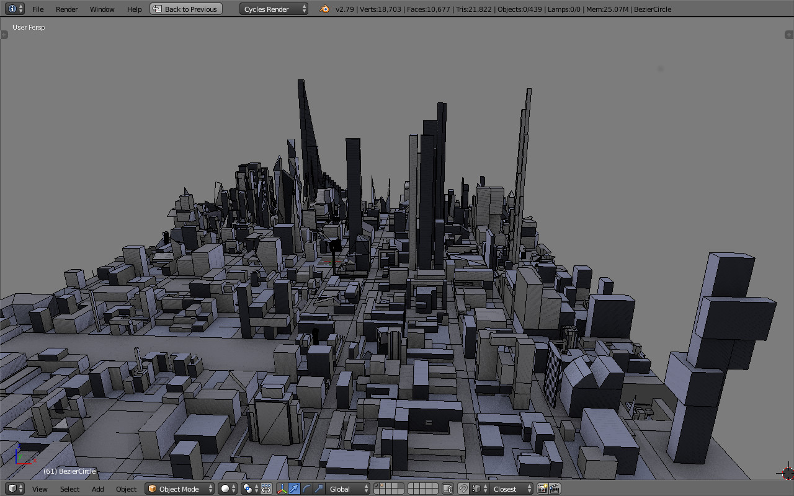

# Alphaville

Alphaville is very simple town generator developed for the purpose of [teaching modeling for students in architecture](https://www.codeatlas.cc/doku.php?id=dessin:start). It basically loads files in a collection of directories and assemble them in a grid fashion. Each file scanned by the script should contain a digital piece of land - a mesh plane - which corresponds to the virtual terrain where each architect imagine and model a simple project. Collecting all individual projects into a larger collective space enable all participants to think the architecture at the scale of a small urban aera, especcially when the [gamemaster](https://en.wikipedia.org/wiki/Gamemaster) introduces some rules ...

CC BY-NC-ND Milovann Yanatchkov 2017
